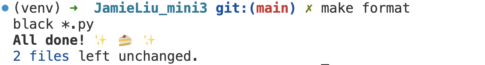
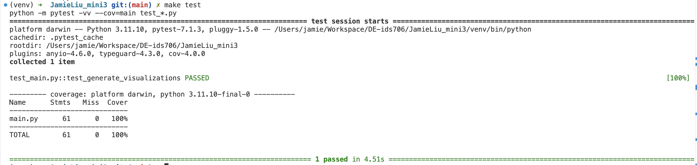

# JamieLiu_mini3

## Overview

## Features

- `.devcontainer` configuration for a consistent Python development environment using Docker.
- **Makefile** to streamline common tasks like setup, testing, linting.
- **GitHub Actions** for automated CI/CD pipeline (testing, linting, and deployment).
- `requirements.txt` for managing Python dependencies.

## Usage

1. **Clone the repository:**

   ```bash
   git clone git@github.com:nogibjj/JamieLiu_mini3.git
   ```

2. **Install dependencies:**

   ```bash
   make install
   ```

3. **Format code:**

   ```bash
   make format
   ```

   

4. **Lint code:**

   ```bash
   make lint
   ```

   

5. **Test code:**

   ```bash
   make test
   ```

   

6. **Run all steps (Install, Format, Lint, Test):**

   ```bash
   make all
   ```

## **Summary Statistics**:


## **Visualization Example**:

### Fatalities 00-14


See detailed statistics and visualizations in this [report](/report.md)
