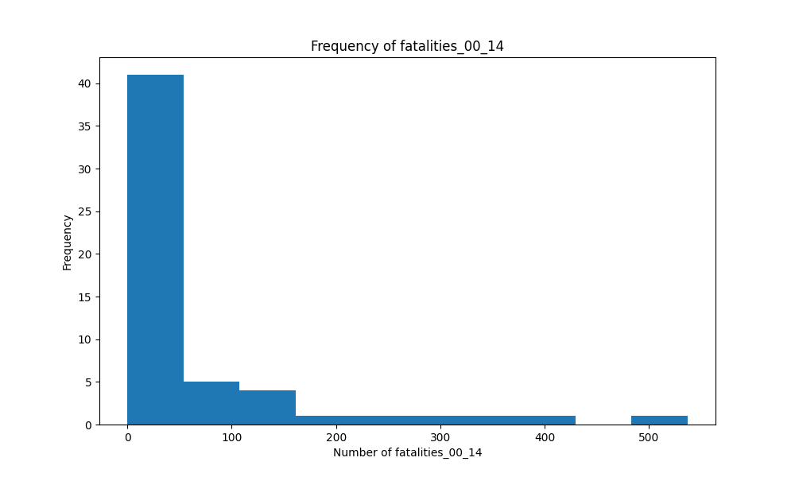

# JamieLiu_mini3

## Overview

In this project, I transform the previous project (Pandas descriptive statistics) into generating descriptive statistics on datasets using Polars.
I'm using the airline safety dataset.

### `main.py`

The `main.py` script defines the core functions used to load the dataset, calculate descriptive statistics, and generate various visualizations (bar charts and histograms). The visualizations illustrate metrics such as incidents, fatal accidents, and fatalities across different time periods. The results, including the descriptive statistics, are saved in a markdown report with linked visualizations. The key functions implemented are:

- `load_dataset()`: Loads the airline safety dataset using Polars.
- `general_polars_describe()`: Calculates the median and general description of the dataset.
- `bar_visual()` and `hist_visual()`: Generate bar charts and histograms for specified columns.
- `general_viz_combined()`: Creates all required visualizations.
- `save_to_md()`: Exports the descriptive statistics and visualizations into a markdown report.

### `test_main.py`

The `test_main.py` script is designed to import the functions from `main.py` and execute them to generate the visualizations and markdown report. This script tests the entire process of loading the dataset, computing statistics, generating visualizations, and writing the output to a markdown file, ensuring that all the functionality implemented in `main.py` works as expected.

## Features

- `.devcontainer` configuration for a consistent Python development environment using Docker.
- **Makefile** to streamline common tasks like setup, testing, linting.
- **GitHub Actions** for automated CI/CD pipeline (testing, linting, and deployment).
- `requirements.txt` for managing Python dependencies.

## Usage

1. **Clone the repository:**

   ```bash
   git clone git@github.com:nogibjj/JamieLiu_mini3.git
   ```

2. **Install dependencies:**

   ```bash
   make install
   ```

3. **Format code:**

   ```bash
   make format
   ```

   

4. **Lint code:**

   ```bash
   make lint
   ```

   

5. **Test code:**

   ```bash
   make test
   ```

   

6. **Run all steps (Install, Format, Lint, Test):**

   ```bash
   make all
   ```

## **Example Visualizations**:

### Fatalities 00-14




See detailed statistics and visualizations in this [report](/report.md)
