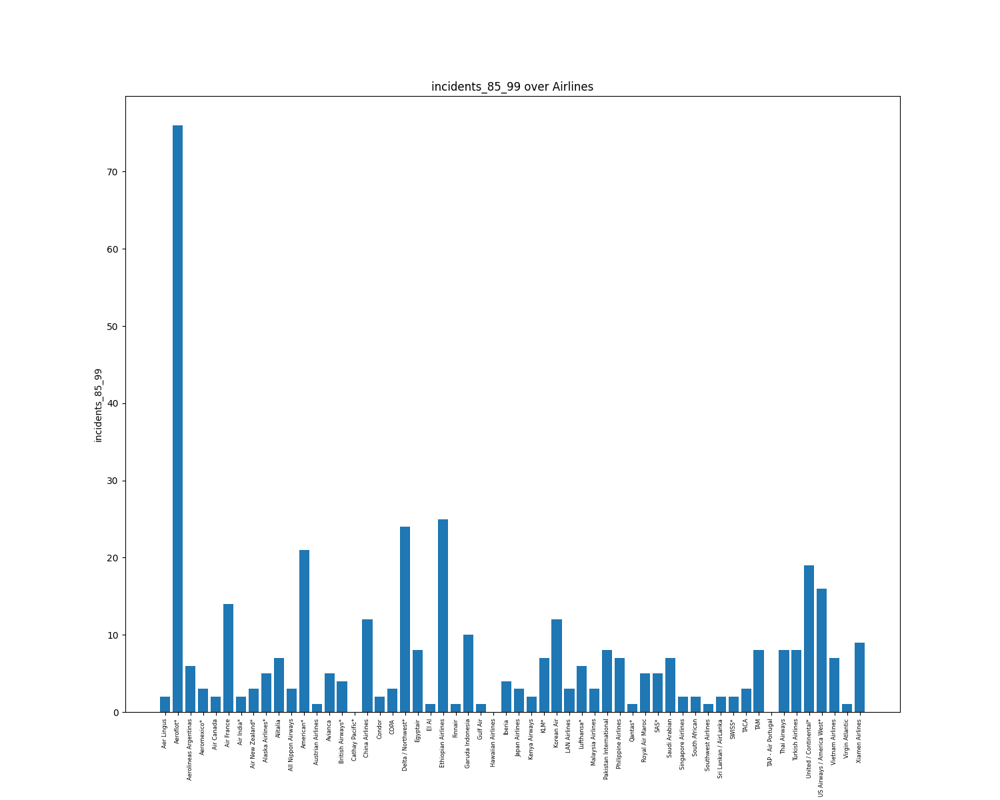
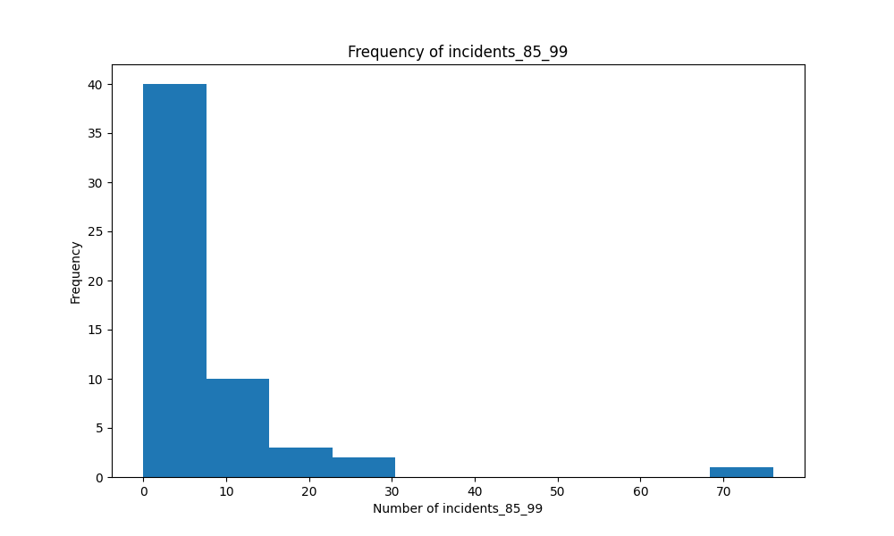
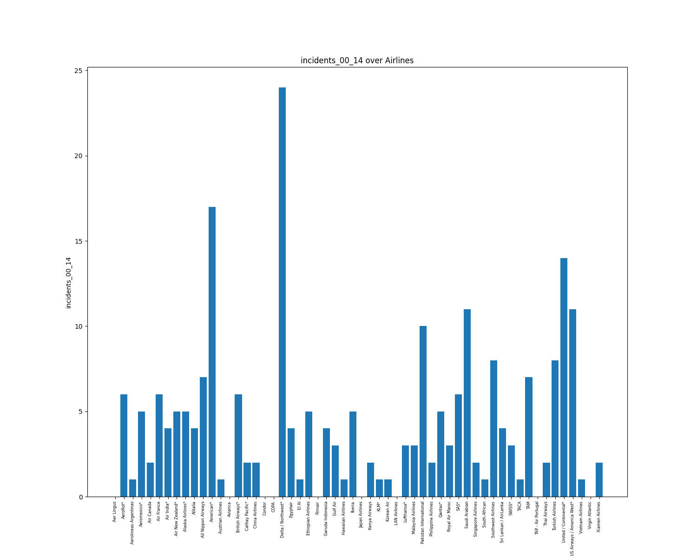
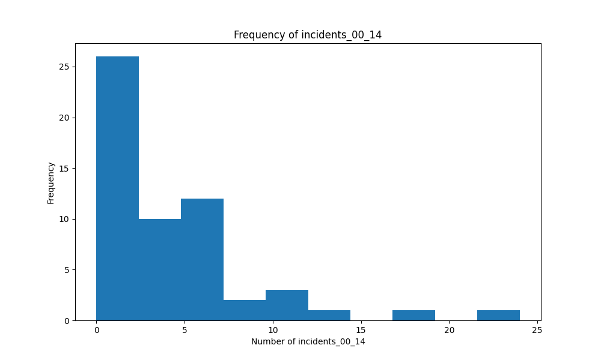
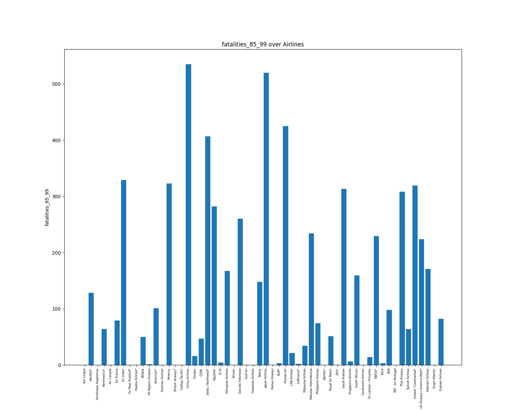
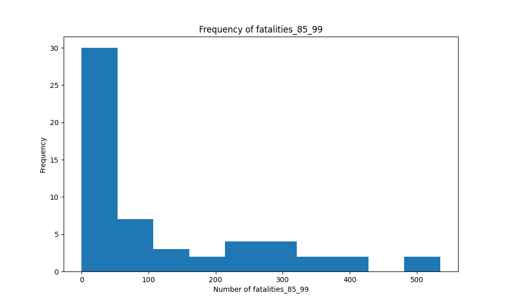
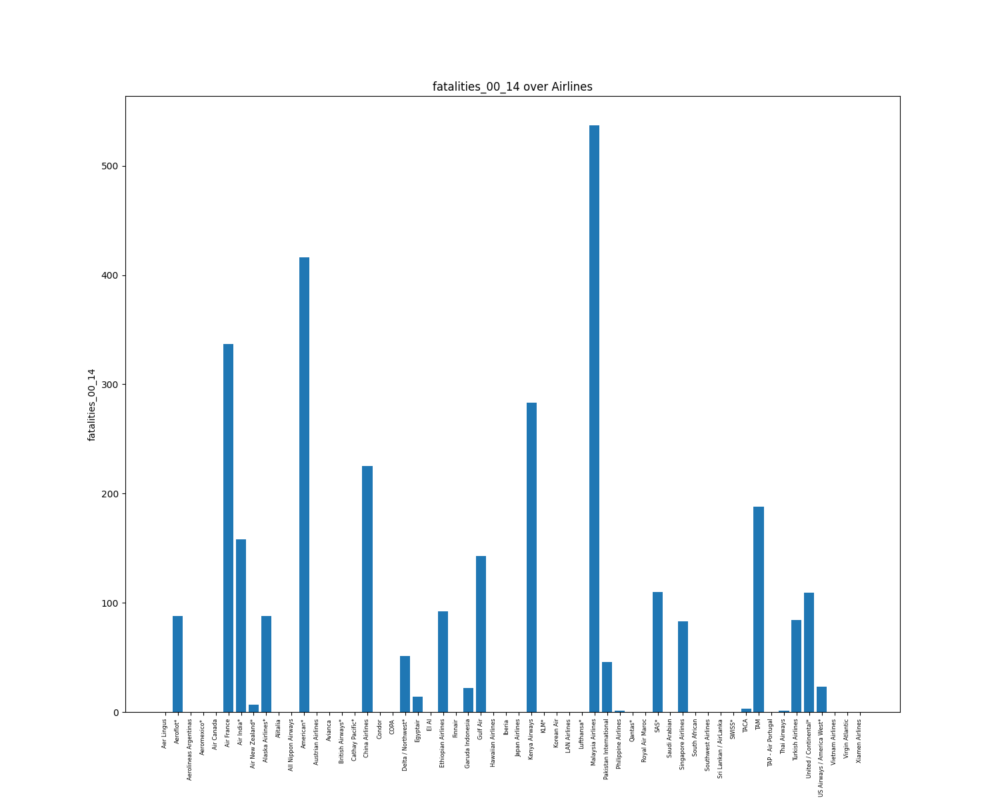
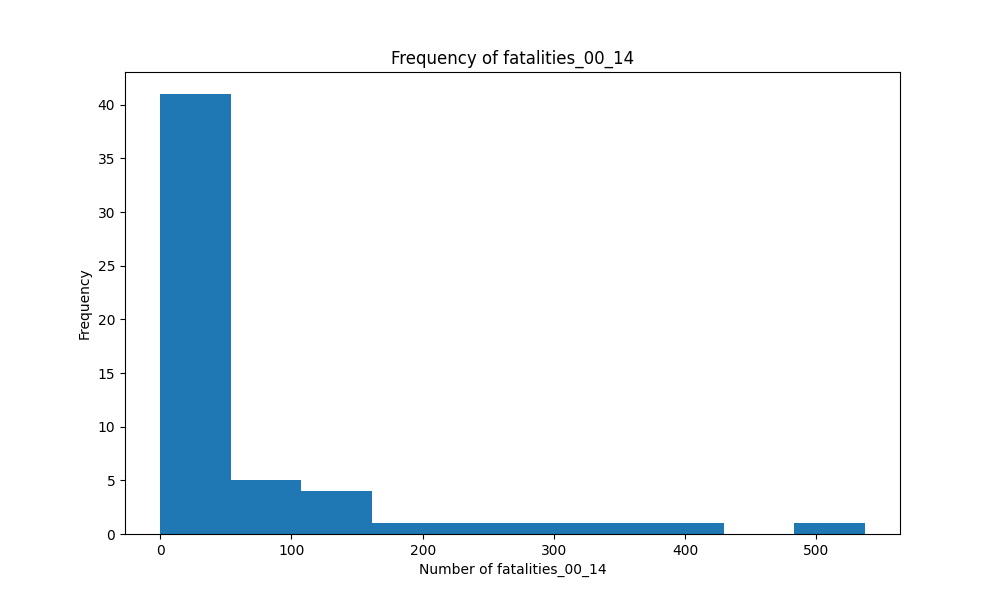

# Report

## General Description

### Description

| statistic | airline | avail_seat_km_per_week | incidents_85_99 | fatal_accidents_85_99 | fatalities_85_99 | incidents_00_14 | fatal_accidents_00_14 | fatalities_00_14 |
| --- | --- | --- | --- | --- | --- | --- | --- | --- |
| count | 56 | 56.0 | 56.0 | 56.0 | 56.0 | 56.0 | 56.0 | 56.0 |
| null_count | 0 | 0.0 | 0.0 | 0.0 | 0.0 | 0.0 | 0.0 | 0.0 |
| mean | None | 1384621304.732143 | 7.178571428571429 | 2.1785714285714284 | 112.41071428571429 | 4.125 | 0.6607142857142857 | 55.517857142857146 |
| std | None | 1465316894.9166627 | 11.035656495456639 | 2.861068731385928 | 146.69111354205404 | 4.544977247667823 | 0.8586836800228956 | 111.3327512168207 |
| min | Aer Lingus | 259373346.0 | 0.0 | 0.0 | 0.0 | 0.0 | 0.0 | 0.0 |
| 25% | None | 488560643.0 | 2.0 | 0.0 | 0.0 | 1.0 | 0.0 | 0.0 |
| 50% | None | 813216487.0 | 4.0 | 1.0 | 50.0 | 3.0 | 0.0 | 0.0 |
| 75% | None | 1841234177.0 | 8.0 | 3.0 | 171.0 | 5.0 | 1.0 | 83.0 |
| max | Xiamen Airlines | 7139291291.0 | 76.0 | 14.0 | 535.0 | 24.0 | 3.0 | 537.0 |

### Median

| airline | avail_seat_km_per_week | incidents_85_99 | fatal_accidents_85_99 | fatalities_85_99 | incidents_00_14 | fatal_accidents_00_14 | fatalities_00_14 |
| --- | --- | --- | --- | --- | --- | --- | --- |
| None | 802908893.0 | 4.0 | 1.0 | 48.5 | 3.0 | 0.0 | 0.0 |

## Visualizations

### Incidents 85_99

### Incidents 00_14

### Fatal Accidents 85_99

### Fatal Accidents 00_14

### Fatalities 85_99

### Fatalities 00_14

